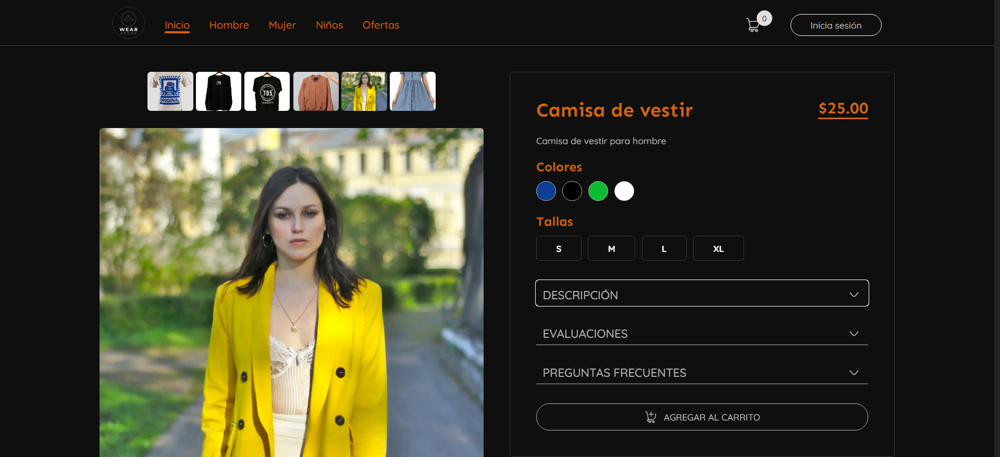
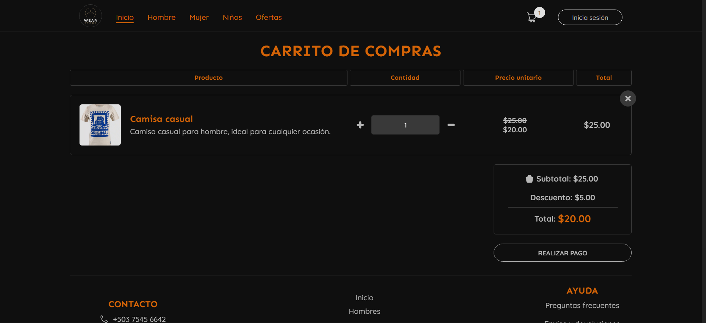
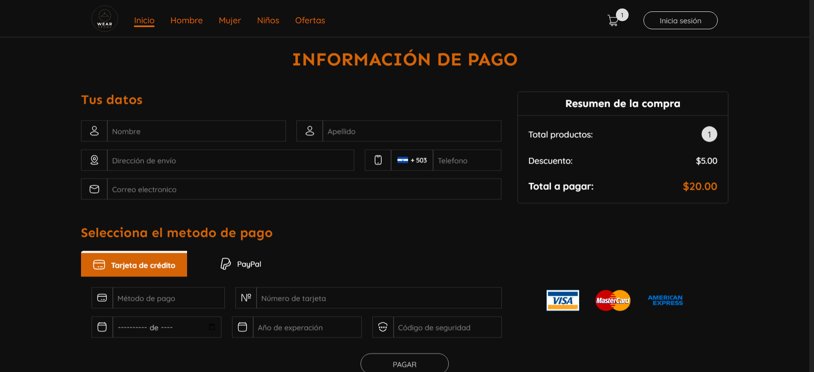
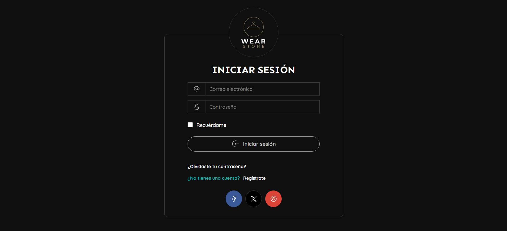
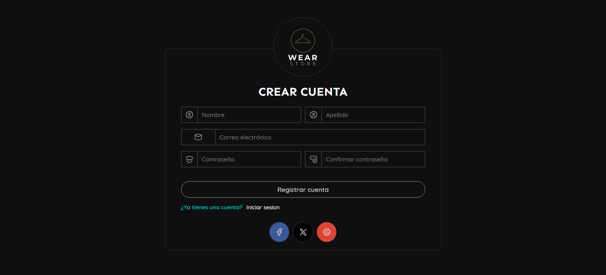

# Wear

Proyecto de diseño, enfocado en diseñar una tienda en línea de ropa, con un simple funcionanmiento de datos con JavaScript.

# Estructura carpetas 

- **/**: Contiene el código fuente del proyecto.
  - **/assets**: Contiene los assets del proyecto.
  - **/assets/js**: Archivos JavaScript para funcionalidades.
  - **/assets/images**: Imágenes utilizadas en el proyecto.
- **/pages**: Contiene las vistas HTML de las diferentes páginas del proyecto.

# Estructura pagina

- Pagina de inicio

- Pagina detalles del producto

- Pagina del carrito

- Pagina del pago

- Pagina del login

- Pagina del registro

- Ver sitio
[Link preview](https://wear-willianarevalos-projects.vercel.app/)

